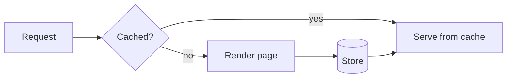
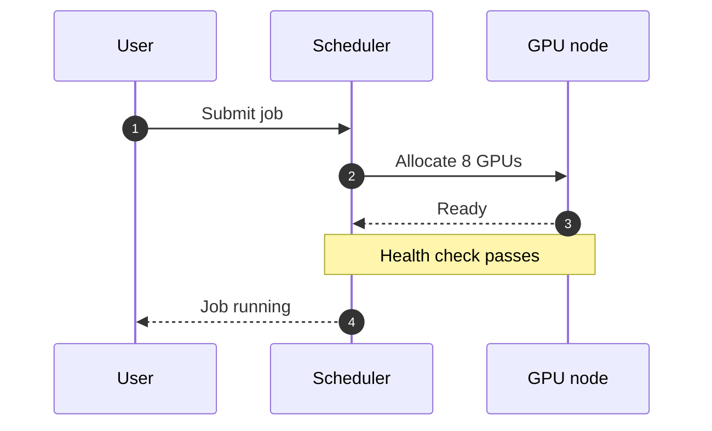

# Diagrams

Mermaid diagrams pick up the scheme colours: coral node borders, muted edges.

## Flowchart

```mermaid
graph LR
  A[Request] --> B{Cached?}
  B -- yes --> C[Serve from cache]
  B -- no --> D[Render page]
  D --> E[(Store)]
  E --> C
```

## Sequence

```mermaid
sequenceDiagram
  autonumber
  participant U as User
  participant S as Scheduler
  participant N as GPU node
  U->>S: Submit job
  S->>N: Allocate 8 GPUs
  N-->>S: Ready
  Note over S,N: Health check passes
  S-->>U: Job running
```
